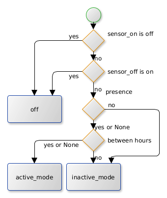

# HA-UpdateClimate

Python script to update climate devices.

## Installation

Download the hacs.py file from inside the python_scripts directory here to your local python_scripts directory, then reload python_scripts in Home Assistant.

## Usage

This python script sets `hvac_mode` and `preset_mode` according to the specified sensors and time.



The `hvac_mode` will be _off_ when:

- At least one window is open
- At least one of the given `sensors_off` is _off_

In all other cases the `hvac_mode` will be the one specified in `active_mode`.
The `preset_mode` is None if the `sensor_presence` is _on_ or not given and the current time is between `heating_from_hour` and `heating_to_hour`.
Otherwise the `preset_mode` is the one specified under `away_mode`.
If one of the specifications `heating_from_hour` or `heating_to_hour` is not given, the `preset_mode` depends only on the `sensor_presence`.

| Name              | Required | Description                                                 |
| ----------------- | -------- | ----------------------------------------------------------- |
| entity_id         | True     | The climates enitity_id                                     |
| windows           | False    | The climate will be off when one of these sensors is on     |
| sensors_off       | False    | The climate will be off when one of these sensors is off    |
| sensor_presence   | False    | The climate will switch to active mode if this sensor is on |
| heating_from_hour | False    | Start time from which heating is to start                   |
| heating_to_hour   | False    | End time to which the heating is to last                    |
| active_mode       | False    | The hvac_mode when active *(defaults to heat)*              |
| away_preset       | False    | The preset_mode when away/eco *(defaults to Heat Eco)*      |

## Example

```yaml
enitity_id: climate.livingroom
windows:
  - binary_sensor.livingroom_window
  - binary_sensor.livingroom_door
sensors_off:
  - binary_sensor.climate_on
  - binary_sensor.livingroom_climate_on
sensor_presence: binary_sensor.someone_at_home
heating_from_hour: 8
heating_to_hour: 17
active_mode: heat
away_preset: away
```

## Automation example

This works with Eurotronic Spirit Z-Wave thermostats.
To use different devices, you may want to change `active_mode` and `away_preset`.

```yaml
- id: 0123456789
  alias: Climate Livingroom
  trigger:
    - hours: "*"
      minutes: "1"
      platform: time_pattern
    - entity_id: binary_sensor.presence
      platform: state
    - entity_id: binary_sensor.livingroom_window
      platform: state
    - entity_id: input_boolean.livingroom_climate
      platform: state
    - entity_id: binary_sensor.all_climates_on
      platform: state
  condition: []
  action:
    - data:
        entity_id: climate.livingroom
        windows:
          - binary_sensor.livingroom_window
        sensors_off:
          - input_boolean.livingroom_climate
          - binary_sensor.all_climates_on
        sensor_presence: binary_sensor.presence
        heating_from_hour: 8
        heating_to_hour: 23
      service: python_script.update_climate
```
